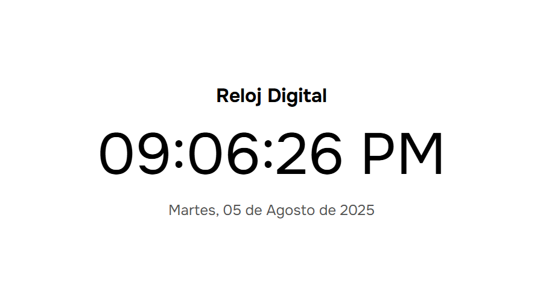

# ⏰ Reloj Digital

Un reloj digital elegante que muestra la hora actual en tiempo real desarrollado con HTML, CSS y JavaScript vanilla. Este es el **Proyecto #5** de mi serie de proyectos de desarrollo web.

## 📋 Descripción

Reloj digital moderno que muestra la hora actual con formato de 12 horas (AM/PM) y la fecha completa en español. Actualización automática cada segundo con sincronización precisa al inicio para evitar desfases temporales.

## ✨ Características Implementadas

- **Hora en tiempo real:** Actualización automática cada segundo
- **Formato 12 horas:** Muestra AM/PM con formato legible
- **Fecha completa:** Día de la semana, fecha, mes y año en español
- **Sincronización precisa:** Inicio sincronizado para evitar desfase
- **Formato padded:** Números con ceros a la izquierda (01, 02, etc.)
- **Nombres en español:** Días y meses en idioma español
- **Diseño minimalista:** Interfaz limpia y moderna
- **Actualización eficiente:** Solo cuando es necesario
- **Responsive design:** Adaptable a diferentes tamaños de pantalla

## 🛠️ Tecnologías Utilizadas

- **HTML5:** Estructura semántica moderna con:
  - Elementos time para accesibilidad
  - Meta tags optimizados
  - Estructura clara de componentes
- **CSS3:** Estilos modernos con:
  - Flexbox para layouts centrados
  - Typography responsive
  - Variables CSS para consistencia
  - Smooth transitions
- **JavaScript ES6+:** Lógica temporal con:
  - Date API nativa
  - Destructuring assignment
  - Template literals implícitos
  - setTimeout y setInterval
  - Módulos de funciones puras
- **Google Fonts:** Tipografía Onest (100-900 weights)

## 🎨 Diseño y Estilo

### Paleta de Colores

```css
/* Tema elegante */
--text-primary: #ffffff; /* Texto principal */
--text-secondary: #cccccc; /* Texto secundario */
```

### Efectos Especiales

- **Tipografía monospace** para números del reloj
- **Box-shadow elegante** en el contenedor
- **Separadores visuales** entre componentes de tiempo
- **Smooth font rendering** para mejor legibilidad

## 📱 Diseño Responsivo

### Características

- **Flexbox centering:** Centrado perfecto en viewport
- **Scalable typography:** Tamaños de fuente adaptativos
- **Mobile-first approach:** Optimizado para móviles primero
- **Aspect ratio maintained:** Proporciones consistentes

## 📂 Estructura del Proyecto

```
05-reloj-digital/
├── index.html              # Página principal
├── styles.css              # Estilos CSS
├── script.js               # Lógica JavaScript
├── screenshots/            # Capturas de pantalla
│   └── app-view.png        # Vista de la aplicación
└── README.md              # Documentación
```

## 🚀 Instalación y Uso

### Clonar el repositorio

```bash
git clone https://github.com/Zero-Fhx/05-reloj-digital.git
cd 05-reloj-digital
```

### Ejecutar el proyecto

1. **Método simple:** Abre `index.html` directamente en tu navegador
2. **Con Live Server (recomendado):**
   - Instala Live Server en VS Code
   - Click derecho en `index.html` → "Open with Live Server"
3. **Servidor local:**

   ```bash
   # Con Python 3
   python -m http.server 8000

   # Con Node.js (http-server)
   npx http-server
   ```

## ✅ Requisitos Cumplidos

Este proyecto incluye todas las características esenciales de un reloj digital:

- [x] Mostrar hora actual en tiempo real
- [x] Actualización automática cada segundo
- [x] Formato de 12 horas con AM/PM
- [x] Fecha completa con día, mes y año
- [x] Interfaz clara y legible
- [x] Diseño moderno y atractivo
- [x] Sincronización precisa al inicio

## 🌐 Demo en Vivo

🔗 **[Ver Demo](https://zero-fhx.github.io/05-reloj-digital/)** (GitHub Pages)

## 📸 Captura de Pantalla



## 🔧 Características Técnicas Destacadas

### Obtención de Tiempo Formateado

```javascript
function obtainTime() {
  time = new Date();

  const hours = time.getHours() % 12 || 12;
  const minutes = time.getMinutes();
  const seconds = time.getSeconds();
  const meridian = time.getHours() >= 12 ? "PM" : "AM";

  const formattedHours = String(hours).padStart(2, "0");
  const formattedMinutes = String(minutes).padStart(2, "0");
  const formattedSeconds = String(seconds).padStart(2, "0");

  return {
    hours: formattedHours,
    minutes: formattedMinutes,
    seconds: formattedSeconds,
    meridian,
  };
}
```

### Manejo de Fechas en Español

```javascript
function obtainDay() {
  const days = [
    "Domingo",
    "Lunes",
    "Martes",
    "Miércoles",
    "Jueves",
    "Viernes",
    "Sábado",
  ];
  const months = [
    "Enero",
    "Febrero",
    "Marzo",
    "Abril",
    "Mayo",
    "Junio",
    "Julio",
    "Agosto",
    "Septiembre",
    "Octubre",
    "Noviembre",
    "Diciembre",
  ];

  const day = days[time.getDay()];
  const date = String(time.getDate()).padStart(2, "0");
  const month = months[time.getMonth()];
  const year = time.getFullYear();

  return { day, date, month, year };
}
```

### Sincronización Precisa

```javascript
const milliseconds = time.getMilliseconds();

updateClock();

setTimeout(() => {
  updateClock();
  setInterval(updateClock, 1000);
}, 1000 - milliseconds);
```

### Actualización Modular del DOM

```javascript
function updateTime(hours, minutes, seconds, meridian) {
  hoursElement.textContent = hours;
  minutesElement.textContent = minutes;
  secondsElement.textContent = seconds;
  meridianElement.textContent = meridian;
}

function updateDay(day, date, month, year) {
  dayElement.textContent = day;
  dateElement.textContent = date;
  monthElement.textContent = month;
  yearElement.textContent = year;
}
```

### Destructuring para Datos Limpios

```javascript
function updateClock() {
  const { hours, minutes, seconds, meridian } = obtainTime();
  const { day, date, month, year } = obtainDay();

  updateTime(hours, minutes, seconds, meridian);
  updateDay(day, date, month, year);
}
```

## ⏱️ Características del Reloj

### Formato de Tiempo

- **12 horas:** Con indicador AM/PM
- **Padding de ceros:** 01:05:09 en lugar de 1:5:9
- **Actualización:** Cada segundo exacto
- **Sincronización:** Inicio preciso sin desfase

### Formato de Fecha

- **Día completo:** Lunes, Martes, etc.
- **Fecha:** Con padding (01, 02, etc.)
- **Mes completo:** Enero, Febrero, etc.
- **Año completo:** 2025, 2026, etc.

## 🔮 Futuras Mejoras

- [ ] **Selector de zona horaria** con dropdown
- [ ] **Formato 24 horas** como opción alternativa
- [ ] **Múltiples zonas horarias** simultáneas
- [ ] **Cronómetro integrado** con start/stop/reset
- [ ] **Alarmas programables** con notificaciones
- [ ] **Temas personalizables** (claro/oscuro/neón)
- [ ] **Animaciones de transición** entre números
- [ ] **Modo pantalla completa** para presentaciones
- [ ] **Sonidos de tick** opcionales
- [ ] **Información meteorológica** integrada

## 📝 Lecciones Aprendidas

### JavaScript Date API

- **Date object** para obtener tiempo actual
- **getHours/getMinutes/getSeconds** para componentes de tiempo
- **getDay/getDate/getMonth/getFullYear** para componentes de fecha
- **Formateo con padStart** para consistencia visual
- **Operador módulo** para formato 12 horas

### Sincronización Temporal

- **setTimeout dinámico** para sincronización inicial
- **setInterval** para actualizaciones regulares
- **getMilliseconds** para cálculo de offset
- **Performance optimization** evitando renders innecesarios

### Modularización

- **Separación de responsabilidades** por función
- **Funciones puras** para formateo de datos
- **Destructuring** para interfaces limpias
- **Single responsibility** por cada función

### Localización

- **Arrays de strings** para nombres en español
- **Mapeo de índices** para días y meses
- **Formateo consistente** de fechas

## 🤝 Contribuciones

Este es un proyecto personal de aprendizaje, pero si encuentras mejoras o tienes sugerencias:

1. Fork el repositorio
2. Crea una rama para tu feature (`git checkout -b feature/mejora`)
3. Commit tus cambios (`git commit -m 'Añadir mejora'`)
4. Push a la rama (`git push origin feature/mejora`)
5. Abre un Pull Request

## 👨‍💻 Autor

**Erick Obed Flores Ricra**

- 🐙 GitHub: [@Zero-Fhx](https://github.com/Zero-Fhx)
- 💼 LinkedIn: [Erick Obed Flores Ricra](https://www.linkedin.com/in/erick-obed-flores-ricra-14a121280)
- 📧 Email: erickflores170404@gmail.com

---

**🤖 Desarrollo Asistido por IA:** Este proyecto fue desarrollado con la asistencia de inteligencia artificial para la búsqueda de información, resolución de problemas técnicos, optimización de código, consulta de conceptos desconocidos y creación de esta documentación.
